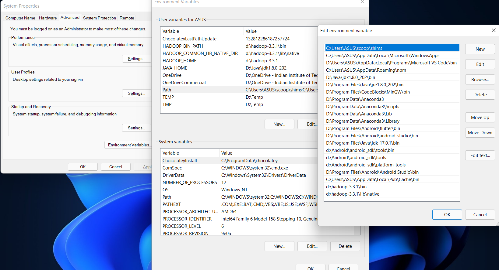

# hadoop-windows
  follow (
     Download: https://drive.google.com/file/d/1B0MmDdEru9oSR3yRja3E5f5Gu818iV0g/view?usp=sharing
     
    I was also facing this same issue, so I removed everything and tried to install from scratch, To solve all issues regarding hadoop installation follow this

    [https://muhammadbilalyar.github.io/blogs/How-to-install-Hadoop-on-Window-10/](url)
  
  

    This blog solved all my issues
   )
   
 - simply download hadoop.tar.gz 
 - Now unzip using `tar -xvf hadoop.tar.gz`
 - Now copy bin folder files, sbin, jars(All files needed in eclipse)
 - Create data named folder inside hadoop or just copy folder there
 - make sure clusterID is same for namenode and datanode (see below if error occured)
 - If jar files missing then try below (NOT NEEDED ACTUALLY)
  
     i) download thirst.exe and put inside `C:\windows` then clone parquet-mr from github `https://github.com/apache/parquet-mr` in `D:\hadoop\share\hadoop\jars\`

     ii) now using choco install make 

     iii) download apache-maven `https://dlcdn.apache.org/maven/maven-3/3.8.4/binaries/apache-maven-3.8.4-bin.tar.gz`

     iv) paste inside `d:\apache-maven` and insert this folder in environment path

     v) run `mvn clean install` inside parquet-mr folder 
 
 - Run start-dfs.cmd
 - Run start-yarn.cmd
 - Now create wordcount.jar with jdk 1.8 see code in tutorial apache 
 - Now create a word.txt file with words
 - Create a /inputdir
 - Now put this word.txt into /inputdir 
 - Now run command in terminal 
 - Check output inside /outputdir 

## To set paths see below



## These are the urls that needed to be opened 

 - http://localhost:9870/dfshealth.html#tab-overview

 - http://localhost:8088/cluster

 - https://www.ncei.noaa.gov/pub/data/uscrn/products/daily01/2015/CRND0103-2015-TX_Austin_33_NW.txt

## This is how eclipse code look like (New Java Project) and libraries added from jars
 exported this as WordCounter.jar

Followed ths steps


```
   If unable to put anything inside a dir created in hadoop
   run start-all.cmd
   
   there are 2 Possible Solutions to resolve

   First:
   Your namenode and datanode cluster ID does not match, make sure to make them the same.

   In name node, change ur cluster id in the file located in:

   $ nano HADOOP_FILE_SYSTEM/namenode/current/VERSION 
   In data node you cluster id is stored in the file:

   $ nano HADOOP_FILE_SYSTEM/datanode/current/VERSION
   Second:

   Format the namenode at all:

   Hadoop 1.x: $ hadoop namenode -format

   Hadoop 2.x: $ hdfs namenode -format
```

## SQOOP

    GRANT ALL PRIVILEGES ON *.* TO 'sqoop'@'localhost' IDENTIFIED BY 'sqoop' WITH GRANT OPTION;

https://medium.com/analytics-vidhya/sqoop-how-to-install-in-5-steps-in-windows-10-ca2f17e11e75

### my.ini

At the end add this line:

    default-time-zone = '+05:30'

from the terminal run this command

    >> sudo mysql -e "SET GLOBAL time_zone = '+5:30';" -u root
    >> sudo mysql -e "SELECT @@global.time_zone;" -u root

If both of them do not work try using this request from sqoop using terminal

    >> sqoop list-databases --connect "jdbc:mysql://localhost/employees?serverTimezone=UTC" --username sqoop -P

Or you can just replace your request URL with this

    jdbc:mysql://localhost/employees?serverTimezone=UTC

https://community.cloudera.com/t5/Support-Questions/Hive-Metastore-initialization-fail/td-p/270124

  `hive --service schematool -dbType derby -password mine -username HIVEAPP -initSchema`
  `hive --service schematool -dbType mysql -password hive -username hive -validate`
